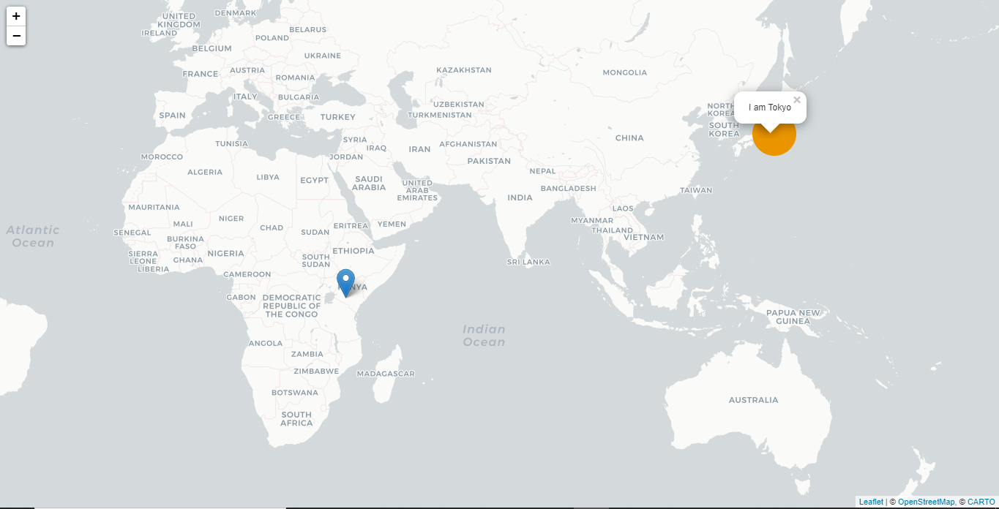

## Working with Markers

Leaflet Markers are used to identify location on a digital map (static or interactive). Markers used are images (png), SVGs or custom HTML element. Leaflet provides the the basic image marker icon in .png file format. The marker consist of two images the icon and it's shadow. Other marker icon options include:

 
 * Circle Marker
 * Div Icons
 * Custom Image Icons


#### Displaying default Marker

Using the previous blog code we add the following

```javascript

    var nairobi = L.marker([-1.284945, 36.822625]).addTo(map);
```


The above code will add a marker located at Nairobi CBD. The above code creates a marker instance, which takes a required argument which can be an array of `[latitude, longitude]` or an instance of `L.LatLng` class such as `L.latLng(-1.284945, 36.822625);`. Always remember the order latitude then longitude.

We can provide descriptive information to the marker using popup. This will be covered in the next tutorial, however, it is as easy as: replace the above line with the following

```javascript
    var nairobi = L.marker([-1.284945, 36.822625]).bindPopup("I am Nairobi").addTo(map);
```


Clicking the marker the popup will be displayed.


### Cricle Markers

Circle markers creates marker either as SVGs or a Canvas element depending on the renderer selected.

```javascript
     // ....
    var tokyo = L.circleMarker([35.6769865,139.7603121]).bindPopup("I am Tokyo").addTo(map);
```


The above code segment create a circle marker with default styling. Like the `L.marker` class the coordinates in the format described previously are required. Default is not always great and does not meet our needs. `L.circleMarker` inherits some properties to create custom styles on the svg. The styles are described using JavasScript object.
Replace the above code with the following.

```javascript
     // ....
   var tokyoStyle = {
        radius:30,
        fillOpacity:1,
        fillColor:"#ea9500",
        color:"#ea9500",
        weight:0
    };

    var tokyo = L.circleMarker([35.6769865,139.7603121], 
        tokyoStyle
    ).bindPopup("I am Tokyo").addTo(map);
```

The above code segment adds specifies the circle radius, circle fill color opacity, fill color (it takes hex codes, color names, rgb), circle outline color and the outline with of 0. The object is added to the as an argument to `L.circleMarker` instance. There are other options on this circleMarker [here](https://leafletjs.com/reference-1.7.1.html#circlemarker-option). Feel free to play around with them.



### Working with custom image as icons.

Information displayed on a map varies a lot from restuarants, schools, recreational facilities, churches etc. All these cannot be represented using a the default marker, that's where custom image icons shines. To create a custom icon for your marker you provide the `L.marker()` instance with the icon optional argument. It is an instance of `L.icon()`.

```javascript
    // ...
    var imageIcon = L.icon({
        iconUrl:'images/user.png',
        iconSize:[30, 30],
        iconAnchor: [22, 94],
        popupAnchor: [-3, -85],
    });

    var rioMarker = L.marker([-22.94351,-43.4049161], {
        icon:imageIcon
    }).bindPopup("i am rio").addTo(map);
```

`L.Icon()` class takes a JavaScript object as an argument. The object has configuration information on the iconUrl (image url), the incon size (width and height) in pixels, the iconAnchor point and popupAnchor. You can provide other more options such as the iconShadow if you have one. More options are [here]("https://leafletjs.com/reference-1.7.1.html#icon"). The result looks as follows;


### Div Icon Markers

As the name suggests the icon is created from HTML div element styled with CSS. The `L.divIcon()` allows to create custom markers. Creating the marker is as simple as shown below.
```css
    /* ... */
    .custom-icon {
        background-color: #c418db;
        padding: 10px;
        border-radius: 40%;
        box-shadow: 2px 2px 0.9em #343434;
    }
```
```javascript
    // ...
    var myDivIcon = L.divIcon({
        className:"custom-icon"
    });

    var osloMarker = L.marker([59.9134424,10.7512913],{
        icon:myDivIcon
    })
    .bindPopup("I am Oslo")
    .addTo(map);
```

The CSS code is used to style the div element with class `.custom-icon` below. `L.divIcon()` takes a JavaScript Object with options such as `className:` used for CSS styling, `html:` to provide the any markup necessary and `bgPos:` specifying the position of the background. The output looks like follows.


In the next tutorial we will Look into `L.geoJson()` class. 

