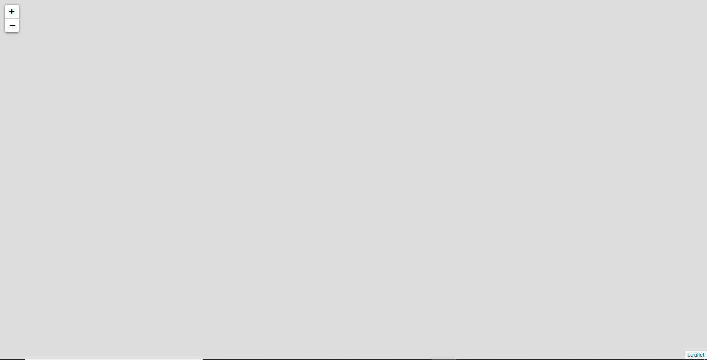
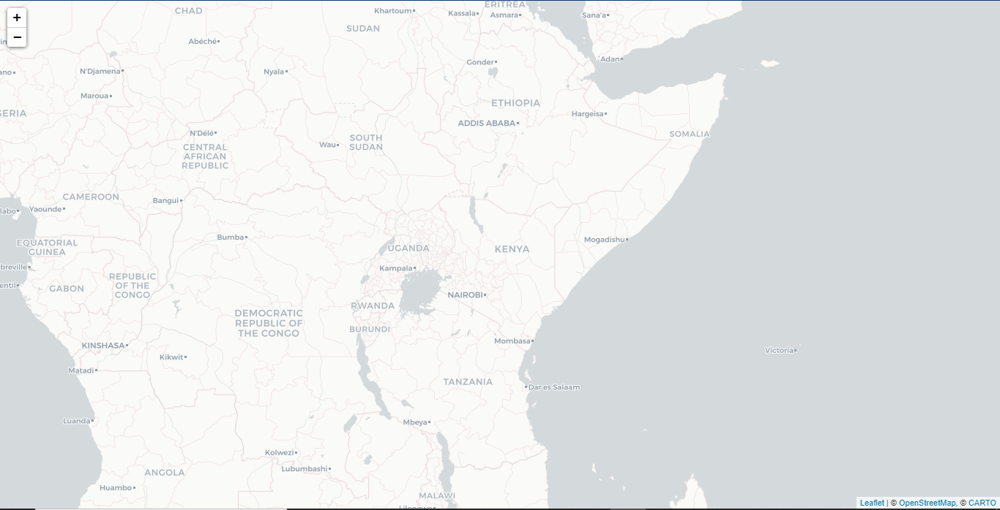

## Introduction to Web Mapping with Leaflet

[Web mapping]('https://en.wikipedia.org/wiki/Web_mapping') is the process of using the maps delivered by geographic information systems (GIS) in World Wide Web. A web map on the World Wide Web is both served and consumed, thus web mapping is more than just web cartography, it is a service by which consumers may choose what the map will show.

### HTML Code segment
Web map will be rendered within a div container with a unique id in this case `<div id="map"></div>`.


```html
    <!DOCTYPE html>
    <html lang="en">
    <head>
        <meta charset="UTF-8">
        <meta name="viewport" content="width=device-width, initial-scale=1.0">
        <title>Web Map Blog 1</title>
        <style>
            /* Styles */
        </style>
    </head>
    <body>
        <div id="map"></div>
        <script>
        </script>
    </body>
    </html>
```

To display the map we will be required to explicity specify the height and th width of the map container. In the styles tags add the following code.

```css
    body{
        margin:0;
    }

    #map {
        height:100vh;
        width:100%;
    }
```

The elemnt selector `body` above removes any margin of the body. The second selector `#map` selector specifies the map height using relative unit `height:100vh;`  will cover the device height while the ` width:100%;` will cover the entire device width. If you want a smaller map you can play around with the values. Other units you can use for the width and height is the pixels i.e `height:300px;`


#### Including Leaflet styles and the JavaScript API.

[Leaflet](https://leafletjs.com/) is an open source mapping library, therefore, is free to use. To get started we need to includes the leaflet styles and leaflet javascript code. We can achieve this in two ways using local files or files hosted in CDN. In these post we will use CDN files since they are updated on a regular basis.

Copy the css link nad JS from [Leaflet](https://leafletjs.com/examples/quick-start/) and paste them within the head immediately after style tag.

```html
    <link rel="stylesheet" href="https://unpkg.com/leaflet@1.6.0/dist/leaflet.css"
   integrity="sha512-xwE/Az9zrjBIphAcBb3F6JVqxf46+CDLwfLMHloNu6KEQCAWi6HcDUbeOfBIptF7tcCzusKFjFw2yuvEpDL9wQ=="
   crossorigin=""/>

   <script src="https://unpkg.com/leaflet@1.6.0/dist/leaflet.js"
   integrity="sha512-gZwIG9x3wUXg2hdXF6+rVkLF/0Vi9U8D2Ntg4Ga5I5BZpVkVxlJWbSQtXPSiUTtC0TjtGOmxa1AJPuV0CPthew=="
   crossorigin=""></script>
```

So far the HTML and CSS sections are ready. At this point you code should be similar to:

```html
    <!DOCTYPE html>
    <html lang="en">
    <head>
        <meta charset="UTF-8">
        <meta name="viewport" content="width=device-width, initial-scale=1.0">
        <title>Web Map Blog 1</title>
        <link rel="stylesheet" href="https://unpkg.com/leaflet@1.6.0/dist/leaflet.css"
        integrity="sha512-xwE/Az9zrjBIphAcBb3F6JVqxf46+CDLwfLMHloNu6KEQCAWi6HcDUbeOfBIptF7tcCzusKFjFw2yuvEpDL9wQ=="
        crossorigin=""/>
    
        <script src="https://unpkg.com/leaflet@1.6.0/dist/leaflet.js"
        integrity="sha512-gZwIG9x3wUXg2hdXF6+rVkLF/0Vi9U8D2Ntg4Ga5I5BZpVkVxlJWbSQtXPSiUTtC0TjtGOmxa1AJPuV0CPthew=="
        crossorigin=""></script>

        <style>
            body{
            margin:0;
            }

            #map {
                height:100vh;
                width:100%;
            }
        </style>
    </head>
    <body>
        <div id="map"></div>
        <script>
            // Map code
        </script>
    </body>
    </html>
```

#### Adding the javaScript code

Within the script tag lets initialize the map object;

```javascript
    var map = L.map('map',{
        center:[0.9877, 38.767],
        zoom:5
    });
```

The above code snippets create a map object `map` which takes two arguments. The first is the `id` of the tag the map will be displayed in. The second is a JavaScript Object with a number of key/value pair. The object specifies the map view center which is an array `[latitude, longitude]` and the map zoom level an integer value.

Open the html file in your browser and this is what you get.



#### Working with Map Tiles (Basemap)

Basemaps provide the user with context of map. It has overlayed information on a variety of features i.e roads, land cover, cities, place names etc. 

We are going to use [CARTO](https://carto.com/) basemaps in these tutorial. A complete list of basemaps they provide is [here](https://github.com/CartoDB/basemap-styles).

``` javascript
    // ....
    var cartoLight = L.tileLayer('https://{s}.basemaps.cartocdn.com/light_all/{z}/{x}/{y}' + (L.Browser.retina ? '@2x.png' : '.png'), {
        attribution:'&copy; <a href="http://www.openstreetmap.org/copyright">OpenStreetMap</a>, &copy; <a href="https://carto.com/attributions">CARTO</a>',
        subdomains: 'abcd',
        maxZoom: 20,
        minZoom: 0
    }); 

    // add the tilelayer to the map
    cartoLight.addTo(map);

```

The above code snippet creates tilelayer. `L.tileLayer()` takes a tile url as the required argument and object with optional key/value pair such as attribution, extent, zoom limits etc. The tilelayer will be displayed between zoom level 0 to level 20. Play around with the values.
The attribution is important to acknowledge other peoples effort in creating the tileLayer. The subdomains are used to refer to the tiles servers. 

More options can be found [here](https://leafletjs.com/reference-1.6.0.html#tilelayer). The last line adds the tilelayer to the map.


The result should be as in the image below.



